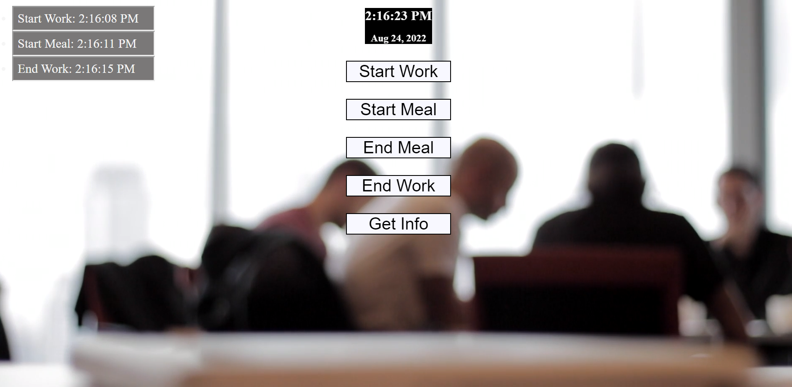

# Time-Clock
Simple Time clock for employees

- The motivation behind this project was to become more familiar with moment.js and other javascript functionalities. 
 
- I built this project to advance my skills working with moment.js 

- This project resolves around having a time clock that allows for a user to clock in, clock out, start a meal and end one. Additionally if the user clicks on get info they will be prompted with their last punches for each section if applicable. 

# Installation
In order to install my project, you will need the following

- Git
- IDE with HTML/CSS/JS capabilities 

To start: 
Clone the repository on GitHub then open Git on your local machine. First find a location of your choice on your computer that you want the folder to be in.
- To change working directory, use the command cd followed by a folder or cd.. to move back  
- Using the command git clone and adding the cloned directory, you will have a copy of this project
- To deploy to your ide type code . 

# Usage 
The purpose of this project is to make a functional timeclock that uses moment.js for time. 

# Deployed Site 
https://wixkedluck.github.io/Time-Clock/

